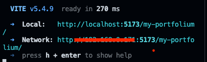

# Introduction

This document has the objective of explain the steps to run the cypress tests locally.

## Step 1 - Install dependencies

```shell

    npm install;

```

## Step 2 - Execute vite dev host

```shell

    npm run dev:host;

```

- The terminal will show the host location.



- Get the Network value.

## Step 3 - Step Local Environments

- Update the file cypress.env.json with your network value that you've got on the step 2.

```json
// BEFORE
{
  "host": "{HOST}"
}
// AFTER

{
  "host": "http://XXX.XXX.XXX/my-portfolio/"
}
```

### Step 4 - Execute the tests

#### Step 4.1 - Execute With UI

```shell
    npm run cypress:run:ui
```

#### Step 4.2 - Execute Without UI

```shell
    npm run cypress:run
```
